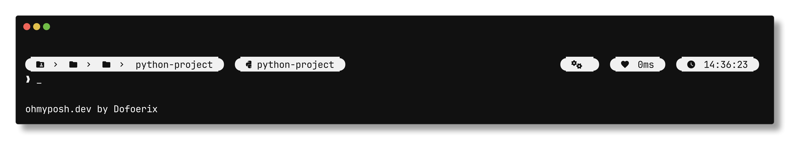
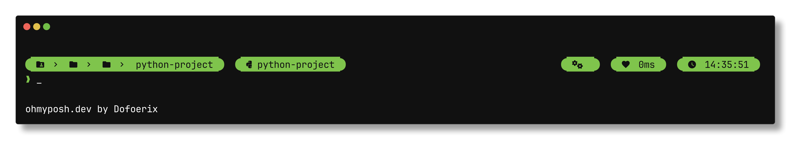
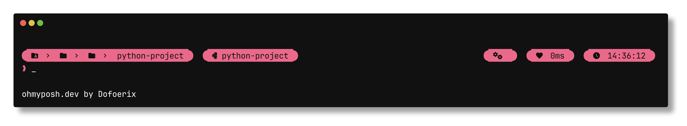

# Dofoerix' Prompt Theme

[Oh My Posh](https://github.com/JanDeDobbeleer/oh-my-posh) theme created to make the prompt more beautiful and convenient.

## Variations

> [!NOTE]
> Certain symbols aren’t rendered properly in previews, but display as expected in use.

### Colors

#### White

#### Green

#### Pink

### Transient prompt

`main.omp.json` files include the [transient prompt](https://ohmyposh.dev/docs/configuration/transient) feature. If you don't want it, use `no_transient.omp.json` instead.

### Other

Other theme variants can be found on [other-themes](https://github.com/Dofoerix/dfrx-prompt-theme/tree/other-themes) and [outdated](https://github.com/Dofoerix/dfrx-prompt-theme/tree/outdated) branches.

Both branches are outdated and not maintained.

## Segments

- Path
- Python virtual environment name (displayed if venv is activated)
- Root (displayed if the current user is root)
- Exit icon (broken heart if exit code ≠ 0)
- Execution time
- Time

## Usage

1. Install [Nerd Font](https://github.com/ryanoasis/nerd-fonts/releases/latest) that you like and set it in your terminal

2. Install Oh My Posh for your system ([Windows](https://ohmyposh.dev/docs/installation/windows), [macOS](https://ohmyposh.dev/docs/installation/macos), [Linux](https://ohmyposh.dev/docs/installation/macos))

3. Clone this repository or download one of the configuration files to any folder (optional if using URL as path)

4. Set the theme using [this](https://ohmyposh.dev/docs/installation/customize#config-syntax) guide

   Replace `~/jandedobbeleer.omp.json` in the command with a path to any variant of this theme (e.g. `~/dfrx-prompt-theme/green/main.omp.json`)

   You can also use the URL of the raw file on GitHub instead of the path (e.g. `https://raw.githubusercontent.com/Dofoerix/dfrx-prompt-theme/main/green/main.omp.json`)
